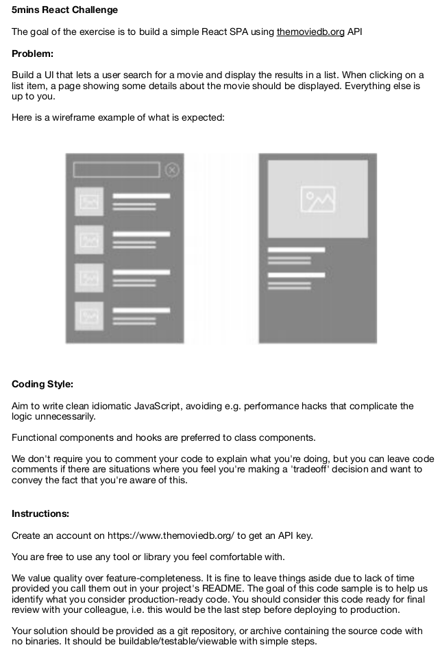

# 5Mins - Movie Application

Hey, How are you? 😉

I will help you to guide yourself in this project, so here are the following topics:

- [5Mins - Movie Application](#5mins---movie-application)
  - [Introduction](#introduction)
  - [How to execute](#how-to-execute)
  - [Technologies](#technologies)
  - [About Me](#about-me)

## <a name="Introduction">Introduction</a>



## <a name="HowToExecute">How to execute</a>

To run this project, perform the following steps:

```
git clone https://github.com/MAugustoG/MovieApp.git
cd movieapp
npm install
```

After that, you have the following options:

- Run tests

```
npm run test
```

- Run locally

```
npm run dev
```

## <a name="Technologies">Technologies</a>

In this project, the leading technologies used are:

- [React (Vite and Typescript)](https://vitejs.dev/) - Development
- [React Query](https://react-query-v3.tanstack.com/) - Fetch and Cache Data
- [Material UI](https://mui.com/pt/material-ui/getting-started/overview/) - Component Library
- [Testing Library](https://testing-library.com/) and [Vitest](https://vitest.dev/) - Tests

## <a name="AboutMe">About Me</a>

To be faster and more efficient, I'll leave the [link](https://www.linkedin.com/in/mateusag/) that explains everything. But for any situation, I will always be available via email at mataugustogomes@gmail.com
